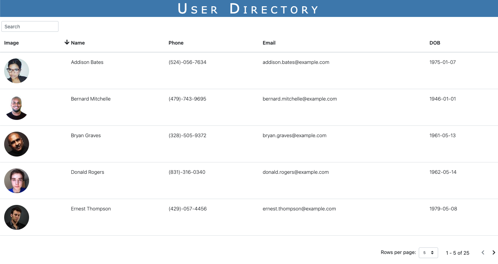

# userDirectory

## Description

This app allows employers to have access to their employees information. This app was created using React. Random user API was used to generate the random users. MDBReact was installed to create the table and search functionality. 

## Table of Contents

* [Installation](#installation)
* [Questions](#questions)

## Installation

The command that should be run to install dependencies is: `npm i` and `npm start`

## Questions

If you have any further questions regarding this project, please feel free to contact.

GitHub Username: ashvinit
Email Address: ashvinithomas@gmail.com

